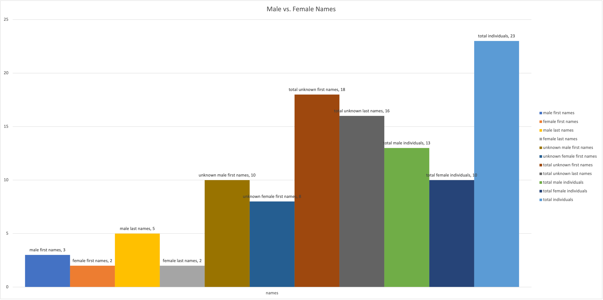
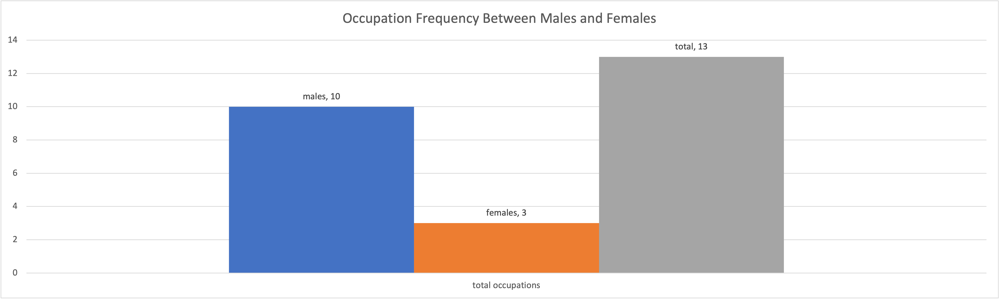
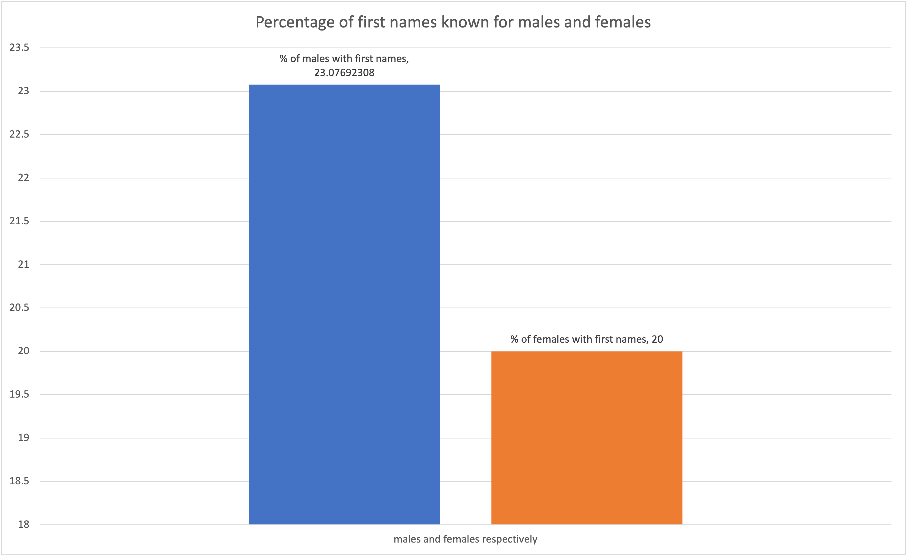

# Topic
After some back and forth I ended up looking at cases from [Old Bailey](https://www.oldbaileyonline.org/) court in England. Due to issues with xml, RScript, and Jupyter Notebook, I concluded that the best way to create any sort of findings would be to manually create a `.csv` table. I used the [API Demonstrator](https://www.oldbaileyonline.org/obapi/) to find cases between 1674 and 1700 that had female defendants. In doing this I was given 1008 results and a list of ten xml files which were at the top. I took those ten and created a `.csv` table of the ten case reports. The Top Ten ended up being from 1675 to 1677.

# CSV Table
[CSV Table](femaleTrialsOldBailey-csv.csv)

# Findings

# Discussion
Through OpenRefine, I cleaned and formated the `.csv` file and then opened the resulting `.csv` in Excel. using excel I was able to create the above graphs. Although the sample size is very small, I believe some hypotheses can be made. First, men seem to have been more likely to be reported with their name, first and last, while women were reported without their names. Second, men were more likely to be reported with their occupation. Finally, third is that for men, a last name seemed to be more available than for women. For men, five had names, two of which were only last names. This could suggest that last names were sometimes more improtant than first names. Only two women on the other hand had names and both had first and last names. This might be indictive of the importance of the last name for men in late 17th century England. One additional thing of interest was that the author of the these files set the occupation atribute for one or two males as husband but never created an occupation of wife. However, I continue to stress that this is a very small sample size and therefore can only give a step in the ocean when it comes to understanding the courts and society in 17th century England as well as those who created this database.
